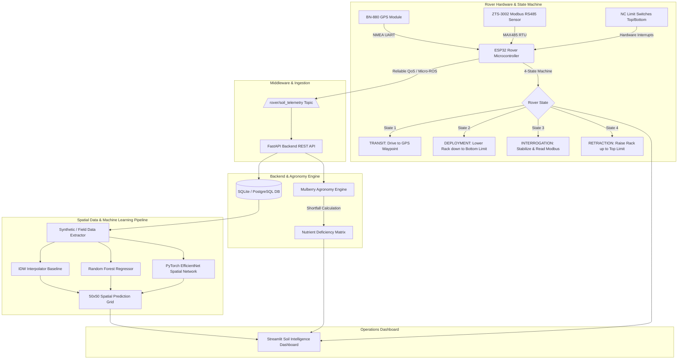

# Precision Sericulture: Automated Rack-and-Pinion Soil Probing Mechanism on a 4WD Autonomous Rover for Mulberry Agronomy


## 📌 Project Overview

**Precision Sericulture** is an end-to-end, distributed IoT, robotics, spatial data engineering, and deep learning platform designed for automated Mulberry agronomy (*Morus alba*). The platform orchestrates an autonomous 4WD differential-drive rover equipped with a 3D-printed PETG linear rack-and-pinion mechanism. The mechanism deploys an industrial Modbus RTU RS485 multi-parameter soil sensor to measure pH, Electrical Conductivity (EC), Moisture, Nitrogen (N), Phosphorus (P), and Potassium (K) directly in the field.

Sparse point observations collected across the plantation are ingested via ROS 2 / micro-ROS into an asynchronous FastAPI backend, stored in an indexed database, evaluated against scientific Mulberry agronomic baselines, and converted into dense spatial grid heatmaps using an **EfficientNet Spatial Neural Network Regressor** benchmarked against classical **Inverse Distance Weighting (IDW)** and **Random Forest** baselines.

---

## 🏗️ System Architecture



---

## ⚙️ Hardware Specifications & ESP32 Pinouts

### Locomotion System (4WD Skid-Steer)
- **Motor Driver**: L298N Dual H-Bridge
- **PWM Frequency**: 1000 Hz (8-bit resolution)
- **Pin Assignment**:
  - `ENA` = Pin 33 | `IN1` = Pin 25 | `IN2` = Pin 26
  - `ENB` = Pin 32 | `IN3` = Pin 27 | `IN4` = Pin 14

### Actuator Probing Mechanism (Linear Rack & Pinion)
- **Motor**: Micro N20 Gear Motor
- **Driver**: L293D Motor Driver
- **Speed**: `actSpeed = 90` (PWM)
- **Pin Assignment**:
  - `ACT_IN1` = Pin 22 | `ACT_IN2` = Pin 21

### Safety Limit Switches (Normally Closed NC)
- **Bottom Limit Switch**: Pin 18 (Active LOW when triggered)
- **Top Limit Switch**: Pin 19 (Active LOW when triggered)

### RS485 Modbus RTU Transceiver
- **Chipset**: MAX485 TTL-to-RS485
- **Pins**: `TX2` = Pin 17, `RX2` = Pin 16 (Hardware UART2, 9600 Baud, 8N1)

---

## 🔒 Strict Rover State Machine Workflow

The rover strictly adheres to a 4-state sequential machine:

1. **STATE 1 — TRANSIT**:
   - Navigation towards target GPS coordinates (`/rover/cmd_vel`).
   - Actuator remains locked in the UP position.
   - Upon reaching waypoint distance threshold (< 0.5m), velocity is set to ZERO (`velocity = 0`).
2. **STATE 2 — DEPLOYMENT**:
   - N20 motor drives rack downwards.
   - Halts immediately when **Bottom Limit Switch NC** is triggered or on 15s safety timeout / E-Stop.
3. **STATE 3 — INTERROGATION**:
   - Pauses for electrochemical sensor stabilization (configurable 3s demo / 3 min real).
   - Reads ZTS-3002 Modbus registers, decodes raw hex values, tags reading with active GPS coordinates.
4. **STATE 4 — RETRACTION**:
   - N20 motor reverses to raise probe upward.
   - Stops immediately when **Top Limit Switch NC** is triggered.
   - Confirms sensor is clear of ground before transitioning back to **TRANSIT**.

---

## 📡 Modbus RTU Register Map (ZTS-3002 Sensor)

| Register Address | Parameter | Raw Resolution | Engineering Unit | Scaling Factor |
| :--- | :--- | :--- | :--- | :--- |
| `0x0000` | Soil Moisture | 0.1 % | % | `val * 0.1` |
| `0x0001` | Temperature | 0.1 °C | °C | `val * 0.1` |
| `0x0002` | Electrical Conductivity (EC) | 1 us/cm | dS/m | `val * 0.001` |
| `0x0003` | Soil pH | 0.1 pH | pH | `val * 0.1` |
| `0x0004` | Nitrogen (N) | 1 mg/kg | kg/ha | `val * 1.0` |
| `0x0005` | Phosphorus (P) | 1 mg/kg | kg/ha | `val * 1.0` |
| `0x0006` | Potassium (K) | 1 mg/kg | kg/ha | `val * 1.0` |

---

## 🌾 Mulberry Agronomic Baseline Targets

The agronomic engine evaluates measured soil readings against standard Mulberry cultivation targets:

- **Soil pH**: Target range `6.5 – 7.5` (`LOW` < 6.5, `OPTIMAL` 6.5-7.5, `HIGH` > 7.5)
- **Electrical Conductivity (EC)**: Target `< 1.0 dS/m` (`NORMAL` < 1.0, `HIGH` >= 1.0)
- **Nitrogen (N) Shortfall**: $\max(350 - \text{measured\_N}, 0)$ kg/ha/year
- **Phosphorus (P) Shortfall**: $\max(140 - \text{measured\_P}, 0)$ kg/ha/year
- **Potassium (K) Shortfall**: $\max(140 - \text{measured\_K}, 0)$ kg/ha/year

---

## 🤖 Real vs. Mock Hardware Abstraction Layer

The system decouples physical hardware using abstract Python interfaces:

```python
from backend.app.services.hardware_interface import (
    GPSInterface, MockGPS, RealGPS,
    SoilSensorInterface, MockSoilSensor, RealModbusSoilSensor,
    RoverHardwareInterface, MockRover, RealESP32Rover
)
```

To switch from Mock mode to physical ESP32 hardware:
Set `MOCK_MODE=False` in `.env` or `config/config.yaml`.

---

## 🚀 Installation & Quick Start

### 1. Prerequisites
- Python 3.11+
- ROS 2 Humble (optional for ROS 2 native node)

### 2. Install Dependencies
```bash
pip install -r requirements.txt
```

### 3. Run One-Command Demonstration Launcher
```bash
python demo.py
```
*Or on Windows:*
```cmd
start.bat
```
*Or on Linux/macOS:*
```bash
./start.sh
```

The demo script automatically:
1. Generates 1,000 synthetic plantation soil samples across 5 deficiency zones.
2. Trains the Random Forest baseline and PyTorch EfficientNet Spatial Regressor.
3. Launches the FastAPI REST Backend on `http://localhost:8000`.
4. Simulates the 4-state Rover State Machine navigation and telemetry collection.
5. Launches the Streamlit Soil Intelligence Dashboard on `http://localhost:8501`.

---

## 🧪 Running Automated Unit Tests

Execute the pytest suite covering state machine transitions, safety limits, agronomic evaluations, API validation, and ML pipelines:

```bash
pytest tests/ -v
```

---

## 🐳 Docker Deployment

To launch the FastAPI backend and Streamlit dashboard in isolated Docker containers:

```bash
docker-compose up --build
```

---

## ⚖️ License & Honesty Statement

This repository contains synthetic dataset generation algorithms for demonstration and simulation purposes. ML predictions rendered in demonstration mode are labeled clearly as **SYNTHETIC DEMONSTRATION** and must be validated with physical field sampling before applying commercial fertilizers.

*Developed by the Precision Sericulture Robotics & Agronomy Engineering Team.*
